# Diagrama de clases del simulador del album Mundial 2026

```mermaid
classDiagram
    direction LR

    class Sticker {
        +int id
        +str equipo
    }

    class Pack {
        +Random rng
        +int total_stickers
        +List~Sticker~ stickers
        +generar_cromo() Sticker
    }

    class Album {
        +Set~int~ stickers_pegados
        +Counter stickers_repetidos
        +int total_stickers
        +agregar(sticker) bool
        +necesita(sticker_id) bool
        +faltantes() int
        +completado() bool
    }

    class Participante {
        +int id
        +Album album
        +int fundas_compradas
        +int intercambios_recibidos
        +cromos_intercambiar Counter
        +comprar_y_pegar(num_fundas) int
    }

    class BasicExchange {
        +ejecutar(participantes) int
        +intercambiar_pares(primero, segundo) int
    }

    class GraphExchange {
        +construir_grafo(participantes) dict
        +ejecutar(participantes) int
    }

    class TriangularExchange {
        <<algoritmo principal>>
    }

    class Simulator {
        +List~Participante~ participantes
        +TriangularExchange exchange
        +int ronda
        +List historial
        +ejecutar_ronda() dict
        +ejecutar_simulacion_completa(max_rondas) dict
        +simular(num_rondas) List
    }

    class MonteCarloSimulation {
        +int semilla
        +ejecutar(num_participantes, num_simulaciones, max_rondas) List
        +simular_rondas(num_simulaciones, num_participantes) List
    }

    class Statistics {
        +List resultados
        +calcular_minimo_fundas() int
        +calcular_minimo_fundas_adicionales() int
        +calcular_promedio_fundas() float
        +prob_empirica() float
        +prob_teorica() float
        +resumen() dict
    }

    class Dashboard {
        +Simulator simulator
        +dict resultados_analisis
        +iniciar()
        +ejecutar_ronda()
        +simular_hasta_completar()
        +iniciar_analisis()
        +ejecutar()
    }

    class LineChart {
        +List datos
        +str titulo
        +establecer_datos(datos, titulo)
        +redibujar()
    }

    Pack *-- Sticker : contiene 7 cromos
    Participante *-- Album : posee un album
    Participante ..> Pack : compra fundas

    TriangularExchange --|> GraphExchange : hereda
    BasicExchange ..> Participante : intercambia entre pares
    GraphExchange ..> Participante : asigna repetidos necesarios

    Simulator *-- Participante : administra 1 a 50
    Simulator --> TriangularExchange : usa por defecto
    MonteCarloSimulation ..> Simulator : ejecuta varias simulaciones
    Statistics ..> MonteCarloSimulation : analiza resultados

    Dashboard --> Simulator : controla el proceso individual
    Dashboard --> MonteCarloSimulation : compara poblaciones
    Dashboard --> Statistics : muestra estadisticas
    Dashboard *-- LineChart : dibuja resultados
```

## Como explicar las relaciones

### Modelos principales

- `Sticker` representa un cromo individual.
- `Pack` representa una funda y genera `7` objetos `Sticker`.
- `Album` guarda los cromos pegados y contabiliza los repetidos.
- `Participante` posee un `Album`, compra fundas y registra los intercambios
  recibidos.

### Intercambios

- `GraphExchange` construye un grafo que relaciona cada cromo faltante con los
  participantes que lo necesitan.
- `TriangularExchange` hereda ese comportamiento y es el algoritmo utilizado
  por defecto en la simulacion.
- `BasicExchange` queda disponible como algoritmo alternativo para intercambios
  directos entre dos personas.

### Simulacion y analisis

- `Simulator` administra a los participantes y ejecuta las rondas.
- `MonteCarloSimulation` crea varios objetos `Simulator` para repetir el
  experimento.
- `Statistics` analiza los resultados obtenidos y calcula minimos, promedios y
  probabilidades.

### Interfaz grafica

- `Dashboard` conecta la interfaz con el simulador, Monte Carlo y estadisticas.
- `LineChart` dibuja la grafica comparativa de fundas adicionales minimas.

## Resumen breve para la exposicion

> El programa esta organizado por responsabilidades. Los modelos representan
> los cromos, las fundas, los albumes y los participantes. El simulador crea la
> poblacion y ejecuta cada ronda. Durante una ronda, el algoritmo de intercambio
> revisa los cromos repetidos y los asigna a participantes que los necesitan.
> Para comparar escenarios se ejecutan varias simulaciones Monte Carlo. Luego la
> clase Statistics calcula los resultados y Dashboard los presenta en tablas y
> graficas dentro de la interfaz.
