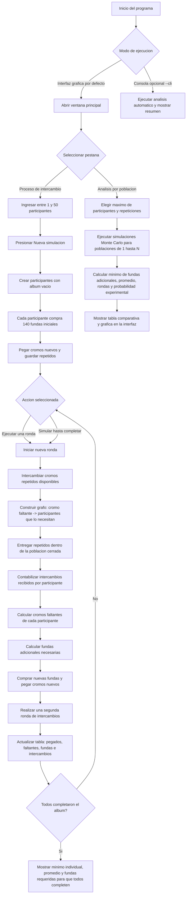

# Diagrama de flujo del simulador del album Mundial 2026

## Lectura rapida del diagrama

- La aplicacion abre una interfaz grafica por defecto.
- Cada participante inicia con `140` fundas de `7` cromos.
- Los cromos nuevos se pegan en el album y los repetidos quedan disponibles.
- En cada ronda se intercambian repetidos dentro de la poblacion cerrada.
- Luego se calculan y compran fundas adicionales segun los cromos faltantes.
- El proceso se repite hasta completar los albumes.
- La segunda pestana compara distintas poblaciones mediante simulaciones Monte Carlo.
